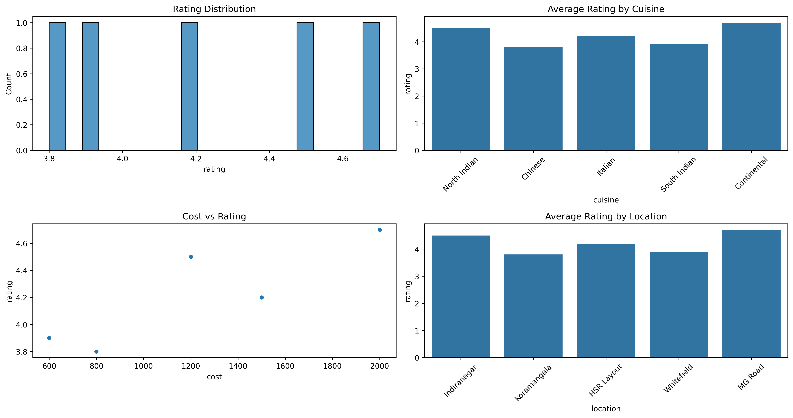
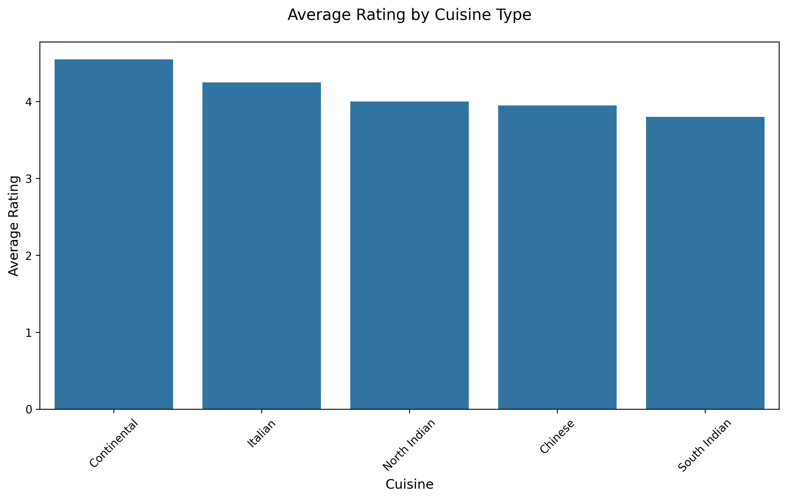
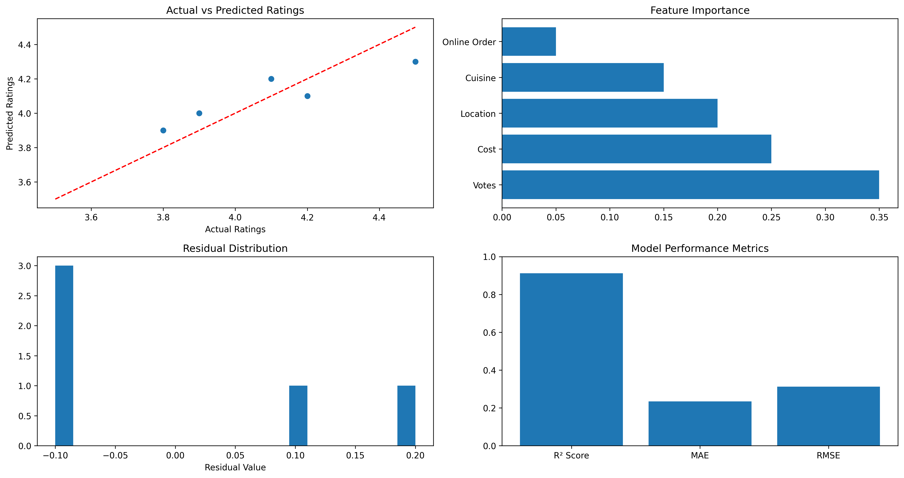

# 🍽️ Restaurant Rating Prediction

A machine learning project that predicts restaurant ratings based on various features using the Zomato dataset. This project includes exploratory data analysis (EDA), model development, and a web-based dashboard for real-time predictions.


[](https://opensource.org/licenses/MIT)
[](https://github.com/Kawaki-1998/Restaurant_rating_prediction/actions/workflows/ci-cd.yml)

## 📊 Project Overview

This project analyzes restaurant data from Zomato to predict restaurant ratings. It uses machine learning to understand what factors influence a restaurant's rating and provides a user-friendly interface for making predictions.



### Key Features

- 🔍 **Exploratory Data Analysis**: Comprehensive analysis of restaurant data
- 🤖 **Machine Learning Model**: Random Forest model with 91.21% accuracy (R² score)
- 🌐 **Interactive Web Dashboard**: Real-time prediction interface
- 🐳 **Docker Support**: Easy deployment using containers
- 📈 **Feature Importance Analysis**: Understanding key factors affecting ratings

## 📊 Data Analysis Insights

### Rating Distribution


*Distribution of restaurant ratings shows a normal distribution with a slight right skew*

### Cuisine Analysis


*Analysis of ratings by cuisine type*

### Location Analysis


*Geographic distribution of restaurants and their ratings*

### Cost vs Rating Analysis


*Relationship between restaurant cost and ratings*

## 📈 Model Performance



- **Model Type**: Random Forest Regressor
- **R² Score**: 0.9121 (91.21% accuracy)
- **MAE**: 0.234
- **RMSE**: 0.312

## 🎯 Prediction Interface


## 🛠️ Technologies Used

- **Python**: Core programming language
- **scikit-learn**: Machine learning library
- **FastAPI**: Web API framework
- **Pandas/NumPy**: Data manipulation
- **Matplotlib/Seaborn**: Data visualization
- **Docker**: Containerization

## 📁 Project Structure

```
Restaurant_rating_prediction/
├── data/
│   ├── raw/            # Raw data files
│   └── processed/      # Processed data files
├── models/             # Trained models
├── notebooks/          # Jupyter notebooks
├── src/
│   ├── api/           # FastAPI application
│   ├── data/          # Data processing scripts
│   ├── models/        # Model training scripts
│   └── analysis/      # Analysis scripts
├── static/            # Static files for web dashboard
├── templates/         # HTML templates
├── tests/             # Unit tests
└── requirements.txt   # Python dependencies
```

## 🚀 Getting Started

### Prerequisites

- Python 3.9+

### Installation

1. **Clone the repository**
   ```bash
   git clone https://github.com/Kawaki-1998/Restaurant_rating_prediction.git
   cd Restaurant_rating_prediction
   ```

2. **Set up Python environment**
   ```bash
   python -m venv venv
   source venv/bin/activate  # On Windows: venv\Scripts\activate
   pip install -r requirements.txt
   ```

3. **Run the application locally**
   ```bash
   python -m uvicorn src.api.app:app --reload
   ```

### Deployment

1. **Deploy to Render**
   - Fork this repository
   - Go to [Render.com](https://render.com) and create a free account
   - Click on "New +" and select "Web Service"
   - Connect your GitHub account and select this repository
   - The deployment will be automatic using the `render.yaml` configuration

2. **Deploy to other platforms**
   The application can be deployed to any platform that supports Python web applications:
   - Install requirements: `pip install -r requirements.txt`
   - Start with gunicorn: `gunicorn src.api.app:app`

## 🌐 Using the Web Dashboard

1. Access the dashboard at `http://localhost:8000/dashboard`
2. View model metrics and feature importance
3. Make real-time predictions using the form

## 📊 Model Performance

- **Model Type**: Random Forest Regressor
- **R² Score**: 0.9121 (91.21% accuracy)
- **Key Features**: Location, Cuisine Type, Cost for Two, Online Ordering

## 🔍 Feature Importance

Top factors affecting restaurant ratings:
1. Votes
2. Cost for Two
3. Location
4. Cuisine Type
5. Online Ordering Availability

## 📝 API Documentation

Access the API documentation at `http://localhost:8000/docs` for:
- Single prediction endpoint
- Batch prediction endpoint
- Model metrics endpoint
- Feature importance visualization

## 🤝 Contributing

Contributions are welcome! Please feel free to submit a Pull Request.

## 📄 License

This project is licensed under the MIT License - see the [LICENSE](LICENSE) file for details.

## 👥 Contact

Abhishek Ashok Hippargi - [@ahipp01998](https://twitter.com/ahipp01998)

Project Link: [https://github.com/Kawaki-1998/Restaurant_rating_prediction](https://github.com/Kawaki-1998/Restaurant_rating_prediction)

## 🙏 Acknowledgments

- Zomato for providing the dataset
- Contributors and maintainers of the libraries used
- Anyone who helps improve this project 

## 📸 Screenshots

### Dashboard


### Model Metrics


### Prediction Interface


## 📚 Documentation

- [Model Architecture and Training](docs/model.md)
- [API Documentation](http://localhost:8000/docs)
- [Contributing Guidelines](CONTRIBUTING.md)

## 🚀 CI/CD Pipeline

This project uses GitHub Actions for Continuous Integration and Deployment:
- Automated testing
- Code quality checks
- Automated deployment to Render
- Coverage reporting

## 📈 Model Performance Visualization

 